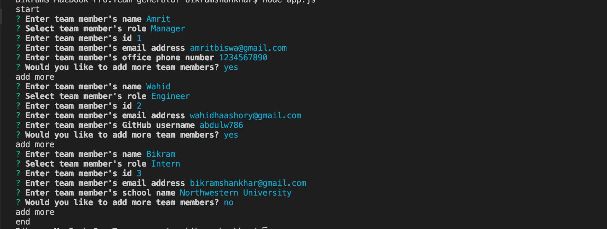
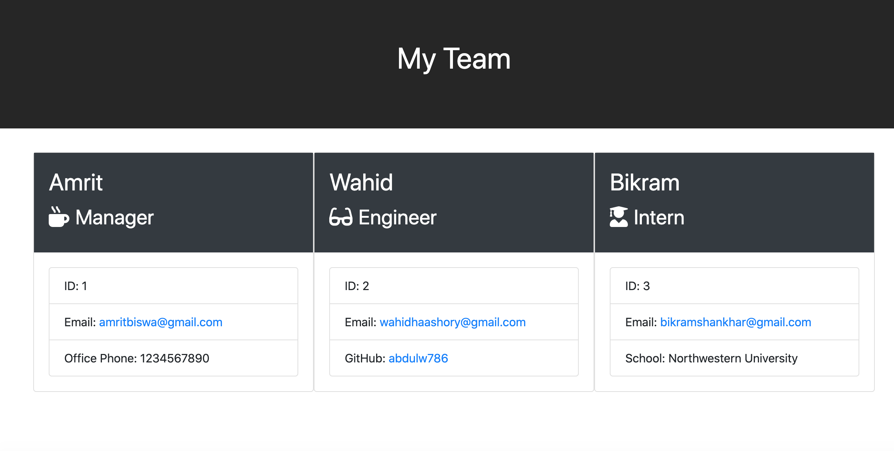

# Team genenator 
This is team generator command line application. The application will prompt the user for information about the team manager and then information about the team members. Node CLI will gather information about each employee and create team.html file.

## Screenshot
 
 

## License
[MIT](https://choosealicense.com/licenses/mit/)